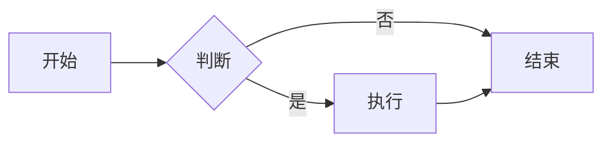

# Markdown 扩展使用

> Zensical 支持的 Markdown 扩展详解

Zensical 使用 Python Markdown 和 PyMdown Extensions 来提供与 MkDocs 相同的 Markdown 方言，确保现有内容的兼容性。

## 配置概述

在 `zensical.toml` 中配置 Markdown 扩展：

```toml
[project.markdown_extensions.扩展名]
# 扩展配置选项
```

## Python Markdown 扩展

### 缩写 (Abbreviations)

为文本添加缩写提示：

```toml
[project.markdown_extensions.abbr]
```

**使用示例：**

```markdown
HTML 规范由 W3C 维护。

*[HTML]: Hyper Text Markup Language
*[W3C]: World Wide Web Consortium
```

**效果：** 鼠标悬停在 HTML 或 W3C 上会显示完整名称。

---

### 警告框 (Admonition)

创建醒目的提示框：

```toml
[project.markdown_extensions.admonition]
```

**使用示例：**

```markdown
!!! note "提示"
    这是一个提示框

!!! warning "警告"
    这是一个警告框

!!! tip "技巧"
    这是一个技巧提示

!!! danger "危险"
    这是一个危险警告

!!! info "信息"
    这是一个信息框
```

**效果：**

!!! note "提示"
    这是一个提示框

!!! warning "警告"
    这是一个警告框

!!! tip "技巧"
    这是一个技巧提示

---

### 属性列表 (Attribute Lists)

为元素添加 HTML 属性：

```toml
[project.markdown_extensions.attr_list]
```

**使用示例：**

```markdown
[链接](https://example.com){: target="_blank" }

{: .center width="300" }

段落文本
{: .custom-class #custom-id }
```

---

### 定义列表 (Definition Lists)

创建术语定义列表：

```toml
[project.markdown_extensions.def_list]
```

**使用示例：**

```markdown
Zensical
:   一个现代化的静态网站生成器

MkDocs
:   一个基于 Python 的静态网站生成器
:   已停止更新
```

**效果：**

Zensical
:   一个现代化的静态网站生成器

MkDocs
:   一个基于 Python 的静态网站生成器

---

### 脚注 (Footnotes)

添加页面脚注：

```toml
[project.markdown_extensions.footnotes]
```

**使用示例：**

```markdown
这是一段带有脚注的文本[^1]。

另一个脚注引用[^note]。

[^1]: 这是第一个脚注的内容。
[^note]: 这是命名脚注的内容。
```

---

### HTML 中的 Markdown (MD in HTML)

在 HTML 标签中使用 Markdown：

```toml
[project.markdown_extensions.md_in_html]
```

**使用示例：**

```html
<div class="grid" markdown>

**粗体文本** 和 *斜体文本*

- 列表项 1
- 列表项 2

</div>
```

---

### 目录 (Table of Contents)

自动生成页面目录：

```toml
[project.markdown_extensions.toc]
permalink = true      # 标题锚点链接
toc_depth = 3         # 目录深度
```

---

## PyMdown Extensions

### 数学公式 (Arithmatex)

支持 LaTeX 数学公式：

```toml
[project.markdown_extensions."pymdownx.arithmatex"]
generic = true
```

还需要添加 MathJax 或 KaTeX：

```toml
extra_javascript = [
    "javascripts/mathjax.js",
    "https://unpkg.com/mathjax@3/es5/tex-mml-chtml.js",
]
```

**使用示例：**

```markdown
行内公式：$E = mc^2$

块级公式：

$$
\int_0^\infty e^{-x^2} dx = \frac{\sqrt{\pi}}{2}
$$
```

---

### 智能强调 (BetterEm)

改进的斜体和粗体处理：

```toml
[project.markdown_extensions."pymdownx.betterem"]
smart_enable = "all"
```

---

### 上标和下标

```toml
[project.markdown_extensions."pymdownx.caret"]   # 上标
[project.markdown_extensions."pymdownx.tilde"]   # 下标和删除线
[project.markdown_extensions."pymdownx.mark"]    # 高亮标记
```

**使用示例：**

```markdown
H~2~O 是水的化学式（下标）

2^10^ = 1024（上标）

==这是高亮文本==

~~这是删除线~~
```

**效果：**

- H~2~O 是水的化学式
- 2^10^ = 1024
- ==这是高亮文本==
- ~~这是删除线~~

---

### 可折叠详情框 (Details)

创建可展开/折叠的内容块：

```toml
[project.markdown_extensions."pymdownx.details"]
```

**使用示例：**

```markdown
??? note "点击展开"
    这是隐藏的内容，点击标题可以展开。

???+ tip "默认展开"
    这个详情框默认是展开的。
```

**效果：**

??? note "点击展开"
    这是隐藏的内容，点击标题可以展开。

???+ tip "默认展开"
    这个详情框默认是展开的。

---

### Emoji 表情

```toml
[project.markdown_extensions."pymdownx.emoji"]
emoji_index = "zensical.extensions.emoji.twemoji"
emoji_generator = "zensical.extensions.emoji.to_svg"
```

**使用示例：**

```markdown
:smile: :heart: :rocket: :thumbsup: :star:
```

**效果：** :smile: :heart: :rocket: :thumbsup: :star:

---

### 代码高亮 (Highlight)

语法高亮的代码块：

```toml
[project.markdown_extensions."pymdownx.highlight"]
anchor_linenums = true
line_spans = "__span"
pygments_lang_class = true

[project.markdown_extensions."pymdownx.inlinehilite"]  # 行内代码高亮
```

**使用示例：**

````markdown
```python title="hello.py" linenums="1" hl_lines="2 3"
def hello():
    print("Hello")
    print("World")
```
````

**效果：**

```python title="hello.py" linenums="1" hl_lines="2 3"
def hello():
    print("Hello")
    print("World")
```

---

### 键盘按键 (Keys)

显示键盘按键样式：

```toml
[project.markdown_extensions."pymdownx.keys"]
```

**使用示例：**

```markdown
按 ++ctrl+alt+del++ 重启系统

按 ++cmd+shift+p++ 打开命令面板
```

**效果：** 按 ++ctrl+alt+del++ 重启系统

---

### 智能符号 (SmartSymbols)

自动转换常见符号：

```toml
[project.markdown_extensions."pymdownx.smartsymbols"]
```

**转换规则：**

| 输入 | 输出 |
|------|------|
| `(c)` | © |
| `(r)` | ® |
| `(tm)` | ™ |
| `-->` | → |
| `<--` | ← |
| `+-` | ± |

---

### 代码块增强 (SuperFences)

增强的代码块功能，支持 Mermaid 图表：

```toml
[project.markdown_extensions."pymdownx.superfences"]
custom_fences = [
    { name = "mermaid", class = "mermaid", format = "!!python/name:pymdownx.superfences.fence_code_format" }
]
```

**Mermaid 流程图示例：**

````markdown

````

---

### 内容标签页 (Tabbed)

创建标签页切换内容：

```toml
[project.markdown_extensions."pymdownx.tabbed"]
alternate_style = true
```

**使用示例：**

````markdown
=== "Python"

    ```python
    print("Hello, World!")
    ```

=== "JavaScript"

    ```javascript
    console.log("Hello, World!");
    ```

=== "Go"

    ```go
    fmt.Println("Hello, World!")
    ```
````

**效果：**

=== "Python"

    ```python
    print("Hello, World!")
    ```

=== "JavaScript"

    ```javascript
    console.log("Hello, World!");
    ```

=== "Go"

    ```go
    fmt.Println("Hello, World!")
    ```

---

### 任务列表 (Tasklist)

创建可勾选的任务列表：

```toml
[project.markdown_extensions."pymdownx.tasklist"]
custom_checkbox = true
```

**使用示例：**

```markdown
- [x] 已完成的任务
- [x] 另一个完成的任务
- [ ] 未完成的任务
- [ ] 待办事项
```

**效果：**

- [x] 已完成的任务
- [x] 另一个完成的任务
- [ ] 未完成的任务
- [ ] 待办事项

---

## 完整配置示例

以下是推荐的完整 Markdown 扩展配置：

```toml
# ===== Python Markdown 扩展 =====
[project.markdown_extensions.abbr]
[project.markdown_extensions.admonition]
[project.markdown_extensions.attr_list]
[project.markdown_extensions.def_list]
[project.markdown_extensions.footnotes]
[project.markdown_extensions.md_in_html]
[project.markdown_extensions.toc]
permalink = true
toc_depth = 3

# ===== PyMdown Extensions =====
[project.markdown_extensions."pymdownx.arithmatex"]
generic = true

[project.markdown_extensions."pymdownx.betterem"]
smart_enable = "all"

[project.markdown_extensions."pymdownx.caret"]
[project.markdown_extensions."pymdownx.mark"]
[project.markdown_extensions."pymdownx.tilde"]
[project.markdown_extensions."pymdownx.details"]
[project.markdown_extensions."pymdownx.keys"]
[project.markdown_extensions."pymdownx.smartsymbols"]

[project.markdown_extensions."pymdownx.emoji"]
emoji_index = "zensical.extensions.emoji.twemoji"
emoji_generator = "zensical.extensions.emoji.to_svg"

[project.markdown_extensions."pymdownx.highlight"]
anchor_linenums = true

[project.markdown_extensions."pymdownx.inlinehilite"]

[project.markdown_extensions."pymdownx.superfences"]

[project.markdown_extensions."pymdownx.tabbed"]
alternate_style = true

[project.markdown_extensions."pymdownx.tasklist"]
custom_checkbox = true
```

## 参考资源

- [Zensical 官方文档 - Python Markdown](https://zensical.org/docs/setup/extensions/python-markdown/)
- [Zensical 官方文档 - PyMdown Extensions](https://zensical.org/docs/setup/extensions/python-markdown-extensions/)
- [Python Markdown 文档](https://python-markdown.github.io/)
- [PyMdown Extensions 文档](https://facelessuser.github.io/pymdown-extensions/)

---

**提示**：Markdown 扩展让你的文档更加丰富多彩！
